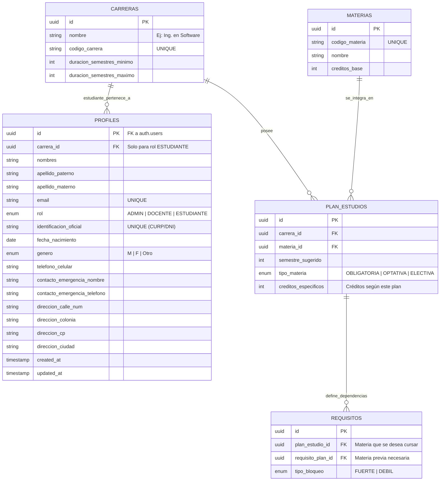

## 📊 Modelo de Base de Datos (ERD)

Este proyecto utiliza **Mermaid.js** para visualizar el esquema. El núcleo de la gestión de usuarios se basa en la tabla `profiles`, la cual se extiende de la autenticación nativa de Supabase (`auth.users`).

